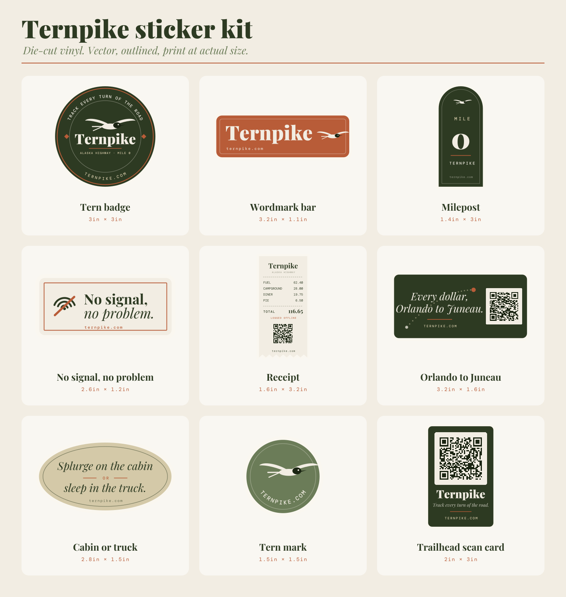

# Ternpike sticker kit

Fourteen die-cut stickers in two families.

**The kit** (nine) are keepsakes — things someone puts on a laptop or a water
bottle. **The scan family** (five) are small, QR-dominant, and cheap to print
by the dozen: for sticking on things out in the world where the QR *is* the
message and you get about one second of someone's attention.

**Every sticker gets someone to the site.** All fourteen print `ternpike.com`;
eight also carry a scannable QR. `verify.mjs` enforces both — it decodes each
QR back out of the rendered pixels and fails the build if a URL-only design
stops printing its URL.



| Slug | Size | Gets you there via | What it is |
|---|---|---|---|
| `qr-trailhead` | 2 × 3in | 1.5in QR + URL | QR-first. Kiosk and bulletin boards. |
| `receipt` | 1.6 × 3.2in | 0.74in QR + URL | Die-cut receipt with a torn edge — the product as an object. |
| `orlando-juneau` | 3.2 × 1.6in | 0.84in QR + URL | The hero line, route plotted behind it. |
| `badge-tern` | 3 × 3in | URL | National-park badge. The flagship — arc-set type, tern, mile-0 line. |
| `wordmark-rust` | 3.2 × 1.1in | URL | Rust bar wordmark with the tern soaring off the end. Bumper/laptop edge. |
| `milepost-zero` | 1.4 × 3in | URL | Alaska Highway milepost. Every trip starts at mile zero. |
| `no-signal` | 2.6 × 1.2in | URL | "No signal, no problem." The offline-first pitch. |
| `cabin-or-truck` | 2.8 × 1.5in | URL | The joke sticker. The decision the app exists to inform. |
| `tern-mark` | 1.5 × 1.5in | URL | Mark plus URL, nothing else. The one you order 500 of. |

The six URL-only designs are the ones where a QR would either not scan or
would wreck the composition — `tern-mark` is 1.5in of bird, and a symbol big
enough to read would leave no bird. If you want one anyway, add
`qr: '<slug>'` to the design and a `qrCard({...})` call; `verify.mjs` will
tell you whether it survives at print size.

## The scan family

| Slug | Size | QR | Per 4×6 label | What it is |
|---|---|---|---|---|
| `scan-mini` | 1.3 × 1.3in | 0.88in | **8** | Smallest useful scan target. |
| `scan-post` | 1.3 × 1.75in | 0.98in | **8** | Tern above the code. |
| `scan-dot` | 1.7in round | 0.84in | **6** | Rounds sit better on poles and bin lids. |
| `scan-strip` | 2.5 × 1in | 0.80in | **6** | "How much have I spent?" — rims, edges, pump handles. |
| `scan-hook` | 2.4 × 1.3in | 1.04in | **4** | "Stop doing math in your head." beside the code. |

### Print any design bigger or smaller

A label printer has one page size, so "print it bigger" has to mean "print
fewer per page". `thermal/sizes/` is that dial — for every design, a 4 × 6
PDF at each count that's worth offering:

```
thermal/sizes/scan-mini-1up.pdf    one 3.72in sticker,  fills the label
thermal/sizes/scan-mini-2up.pdf    two 2.74in stickers, half each
thermal/sizes/scan-mini-4up.pdf    four 1.8in stickers, a quarter each
```

Each cell is filled as fully as the sticker's aspect allows, rotating and
choosing the grid (4 stacked rows vs a 2×2) to whichever prints biggest.
The caption strap along the bottom names the design, the count and the
finished size, so a stack of printed labels stays sortable. `index.json`
lists everything generated.

**Designs reflow rather than refuse.** `art` receives a `ctx` whose `scale`
is the factor the sticker is about to print at (`Infinity` for a full-size
render, so the full layout is the default). A design that would otherwise
be illegible small can respond:

- `qr-trailhead` sets "Track every turn of the road." on **two** lines
  below ~1.05×. One line needs about two inches at 11pt and the sticker is
  under two inches wide, so the choice was two lines or no small size.
- `badge-tern` swaps "MADE ON THE ALASKA HIGHWAY" for "ALASKA HIGHWAY"
  below 1×. Growing the long line to clear the floor pushes it outside the
  inner ring; both fragments come from `footer.legal`.
- Most designs just grow their smallest line via `smallest(ctx, base)` —
  the URL is the smallest thing on nearly every sticker and therefore the
  usual blocker.

**Some counts still don't exist**, and the build reports why:

- `3:type` — even reflowed, the smallest line drops under the 203 DPI
  floor. The dense designs bottom out first.
- `4:qr` — the QR would fall under 0.75in, where a phone stops picking it
  up casually.
- `3:=4up` — the step would print the same size as the next, so only the
  higher count ships. Three stacked rows and a 2×2 grid land within a few
  percent for a square sticker, and at equal size more stickers wins.

A sticker that prints but can't be read or scanned is worse than one that
isn't offered, so those steps are skipped rather than silently shrunk.

PDF only here. A size sheet is just the base design tiled and scaled — its
SVG is megabytes of duplicated artwork that nothing prints, and the vector
source is already in `svg/` and `thermal/<slug>.svg`.

Three rules these follow that the kit doesn't, all in service of getting
scanned by someone who wasn't looking for you:

- **QR ≥ 0.78in.** Below that a phone has to be aimed deliberately, and
  nobody is deliberate about a sticker on a bin.
- **Type authored at or above the thermal floor** (mono ≥ 10 units, Playfair
  Bold ≥ 13). Every scan design reports `1.00×` — no scale-up, so the label
  gangs the maximum. Designing above the floor is free; scaling up to reach
  it costs stickers per label.
- **A reason to scan.** A bare QR gets ignored. `scan-hook` and `scan-strip`
  lead with a hook — the waitlist headline and the question the origin story
  opens with — because curiosity is what converts a glance.

Each design has its own QR slug (`mini`, `dot`, `hook`, `post`, `strip`), so
`GET /admin/qr` tells you which shape and which line actually earn scans —
and, from the edge geo, roughly where.

## Copy comes from `content.yaml`

**No sticker retypes a line.** Every word is pulled from
`marketing/src/content.yaml` — the same file that renders ternpike.com — via
`lib/copy.mjs`, and every shortened version is checked against its source.
Reword `hero.headline` and this build *fails* rather than quietly shipping
last season's headline on stock that outlives the edit. Same bargain
`marketing/test/pricing.matrix.spec.mjs` makes for the pricing bullets.

| Sticker text | Source |
|---|---|
| "Track every turn of the road." | `brand.tagline` |
| "Every dollar, from Orlando to Juneau." | `hero.headline` |
| "Works without signal" | `features.items[0].title` |
| "Stop doing math in your head." | `emailCapture.headlineHtml` (broken where the site breaks it) |
| "How much have I spent?" | `origin.paragraphs[0]` |
| "Splurge on a cabin … or sleep in the truck" | `howItWorks.steps[2].body` |
| "MADE ON THE ALASKA HIGHWAY" | `footer.legal` |
| "Ternpike" | `brand.name` |

Three guards, all in `lib/copy.mjs`:

- `line(path)` — whole line, verbatim; throws if the path is gone.
- `fragment(path, text)` — a shorter line lifted out of a longer one; throws
  unless it's still a substring.
- `split(path, parts)` / `wrap(source, parts)` — a line broken across a
  narrow column; the parts must rejoin into exactly the source, which is what
  stops a "line break" becoming a rewrite.

**The one thing not sourced is "MILE 0"** on the milepost sticker. That's a
visual device — a highway marker needs a number — not a claim about the
product.

## What's in here

```
svg/<slug>.svg      colour, one sticker each — artwork only, no cut guides
png/<slug>.png      the same at 300 DPI, for portals that only take raster
sheets/print-sheet.svg    US Letter gang sheet, 11 stickers, dashed cut guides
thermal/<slug>.pdf  4×6 label, print THIS — exactly 4×6in, no rescaling
thermal/<slug>.svg  the same as vector, if you want to edit it
thermal/<slug>.png  the same at 203 DPI, hard-thresholded to one bit
thermal/sizes/<slug>-Nup.pdf       every design at every workable size
thermal/sizes/index.json           what got generated
thermal/plan.json   per-design scale and cell geometry
sheets/contact-sheet.svg  the review image above
```

The **SVGs are the deliverable.** All type is outlined to paths, so a shop
opening the file without Playfair Display or DM Mono installed still gets the
right letterforms instead of a silent Helvetica substitution. Each file
declares its `width`/`height` in inches, so it imports at 1:1 rather than at
whatever the importer guesses.

## Printing

**Die-cut vinyl (a real print run).** Send `svg/<slug>.svg`. Every sticker's
silhouette *is* the cut line, and each carries a 0.07in parchment keyline
inside that edge — the white border you see is deliberate, and it's what gives
the cutter registration slop. Vendors that want a named spot-colour cut path
(`CutContour`) can duplicate the outermost path; it's the first element in the
file. Ask for **matte** vinyl: the palette is muted and gloss fights it.

**At home.** Print `sheets/print-sheet.svg` on 8.5 × 11 sticker paper at
**100% / actual size** — not "fit to page", which silently scales everything
down a few percent. Cut on the magenta dashed guides, then delete or ignore
the `#cut-guides` group if you'd rather cut by eye. The individual SVGs have
no guides at all.

**Minimum legible size.** The smallest type in the kit is 7pt-equivalent
(`ternpike.com` on `no-signal` and `wordmark-rust`). Don't scale any sticker
below 100% or that line closes up.

## Printing on a thermal label printer

`thermal/` is the same nine designs rendered for a direct thermal head.
Target hardware is the **Munbyn RW403B** — direct thermal, **203 DPI**,
4 × 6in max media — and the numbers below are sized to that spec rather than
to a guess. Output is **pure black on white, one sticker design per 4 × 6
label, ganged to fill it.**

**Print `thermal/<slug>.pdf`, not the SVG** — especially from an iPhone or
iPad. iOS Safari ignores `@page size` and renders any HTML/SVG print job onto
the system paper default, so an SVG label arrives letterboxed on US Letter
and comes out scaled down. A PDF that already declares 288 × 432pt can't be
reinterpreted. (`server/qrPdf.js` exists for the same reason; the constraint
doesn't change just because these labels are generated ahead of time.)

The PDF embeds the already-thresholded bitmap rather than vector art. The
head reduces everything to one bit at 203 DPI regardless, so embedding the
bilevel image is what makes the proof and the print the same object. The SVG
is there if you want to edit a design; the PNG is the proof.

| Design | Scale | Per 4×6 label |
|---|---|---|
| `scan-mini` | 1.00× | 8 |
| `scan-post` | 1.00× | 8 (rotated) |
| `scan-dot` | 1.00× | 6 |
| `scan-strip` | 1.00× | 6 (rotated) |
| `scan-hook` | 1.00× | 4 |
| `tern-mark` | 1.00× | 6 |
| `wordmark-rust` | 1.08× | 4 |
| `no-signal` | 1.30× | 3 |
| `milepost-zero` | 1.22× | 3 (rotated) |
| `cabin-or-truck` | 1.30× | 2 |
| `qr-trailhead` | 1.18× | 2 (rotated) |
| `badge-tern` | 1.14× | 1 |
| `receipt` | 1.50× | 1 |
| `orlando-juneau` | 1.30× | 1 (rotated) |

Three things drive that table, and none of them are stylistic:

- **Ink coverage.** A dark-field design printed as-is is a solid black slab:
  slow, smeary, and hard on the head. The mono profile turns every field
  white, so dark designs invert into line art. That's why the badge prints as
  an outlined ring rather than a filled disc.
- **No grey.** One bit per dot means a 35%-opacity hairline dithers into
  speckle. Every opacity collapses to 1, and decoration that relied on
  receding gets dropped — the route dots behind *Orlando to Juneau* cross the
  descenders at full black, so the mono profile omits them.
- **203 DPI has a legibility floor.** Counters fill in below ~7pt mono / 9pt
  Playfair Bold, and Playfair's hairline serifs vanish below ~11pt. Each
  design is scaled up until its *smallest* run clears that floor — uniformly,
  so the composition holds. That's the Scale column, and it's computed from
  the type actually drawn, not guessed.

The dashed outline on each is a scissor guide — cut on it and it's gone.

**Printing over Bluetooth from the Munbyn app?** Feed it
`thermal/<slug>.png`. Those are 812 × 1218 px, which is 4 × 6in at exactly
203 DPI — one pixel per dot of the RW403B head, already thresholded to one
bit. Nothing resamples it, so what you proof is what the head lays down.
Use the PDF for AirPrint / desktop printing, where the page size is what
needs pinning.

**On a 300 DPI head instead?** These still print, just larger than they
need to be — raise the resolution assumption by dropping the `DM Mono`
floor in `FLOOR_PT` (lib/profiles.mjs) from 7pt toward 5pt and rebuild to
gang more per label.

**For plain tracked QR labels, you may not want this kit at all.**
`server/qrPdf.js` already serves purpose-built 4×6 PDFs for this printer at
`https://ternpike.com/qr/<slug>/sticker.pdf?size=large|medium|small` — 1, 6,
or 12 per label, and PDF rather than SVG specifically because iOS Safari
ignores `@page size` and letterboxes onto US Letter. Use that when you want
cheap tracked labels; use `thermal/` when you want the actual designs.

## The QRs are tracked

Every QR points at `https://ternpike.com/qr/<slug>` — the existing redirect in
`server/qr.js`, not a bare link to the homepage. That route bumps a per-slug
counter in `QR_KV`, rolls up the scanner's Cloudflare edge geo, and 302s to
`ternpike.com/?ref=qr-<slug>`.

Each design has its own slug (`trailhead`, `receipt`, `route`), so
`GET /admin/qr` answers the question that justifies putting a QR on swag at
all: **which design actually gets scanned, and where.** Slugs need no
registration — an unseen slug is counted on first scan.

Change a slug in `lib/stickers.mjs` if you want per-batch attribution instead
of per-design (`ak24`, `booth-3`). Anything matching `[a-z0-9-]{1,32}` works.

This is the same machinery behind the 2 × 1in thermal labels
(`server/qrSvg.js`), which still exist and are still the right tool when you
want a cheap tracked label rather than a keepsake. Hand out both.

## Regenerating

```sh
npm i --no-save opentype.js sharp qrcode-generator jsqr pdf-lib
node marketing/stickers/build.mjs          # SVG + PNG + sheets
node marketing/stickers/build.mjs --no-png # vectors only, skips sharp
node marketing/stickers/verify.mjs         # decode every QR out of the PNGs
```

**Run `verify.mjs` after any layout change near a QR.** It decodes each symbol
three ways: from the colour artwork at 300 DPI, from the same downscaled to
150 px-per-inch (deliberately worse than a phone at arm's length), and from
the 1-bit thermal label. A quiet zone eaten by a nudged coordinate produces a
picture that looks like a QR and scans like a smudge; this is the only check
that catches it before the print run.

It also asserts every thermal PDF is exactly one 4 × 6in page, since a label
PDF at any other size gets scaled to fit by the print path — the precise
failure the PDF format is there to prevent.

It crops to a single cell before decoding a thermal label, because a ganged
label carries several finder-pattern triples and jsQR resolves none of them.
That's a decoder limitation rather than a print defect — but the two are
indistinguishable from a pass/fail line, which is why the crop uses the real
cell geometry from `thermal/plan.json` instead of a guess.

None of these are in any `package.json`. Nothing in CI runs this — the
generated files are committed, and the kit changes about as often as the logo
does. Fonts are fetched from Google Fonts on first run and cached in `.fonts/`
(gitignored); both families are SIL OFL 1.1, which permits outlining and
redistribution.

Designs live in `lib/stickers.mjs`, one object each. Coordinates are in
**1/100 inch**, so `y: 172` means "1.72 inches down" — the unit you actually
think in when deciding whether a line survives at 2 inches wide. `lib/shapes.mjs`
holds the silhouettes and the tern mark; `lib/type.mjs` does text→path.

**Designs name roles, never colours** — `p.dark`, `p.onDark`, `p.accent`. A
profile in `lib/profiles.mjs` decides what each role is worth, which is the
only reason one set of artwork can be both colour vinyl and thermal line art
without two copies drifting apart. Reaching for a hex literal in a design
means the role you want is missing; add it to both profiles instead.

Brand values come from `src/theme.css` and are mirrored in `BRAND` in
`lib/profiles.mjs`. If the palette moves, move it there too — a sticker in
last season's green is worse than no sticker.

### Two traps worth knowing about

`opentype.js@2.0.0` cannot shape Playfair Display (it throws on the font's
`ccmp` lookup), and its path serializer rounds some coordinates to `NaN` —
which drops whole letters from the render with no error at all. `lib/type.mjs`
sidesteps both by laying glyphs out directly and serializing path data itself.
Don't "simplify" it back to `font.getPath(...).toPathData()`; the first
version of this kit shipped a badge reading `TRACK EVER TRN F THE RAD`.
